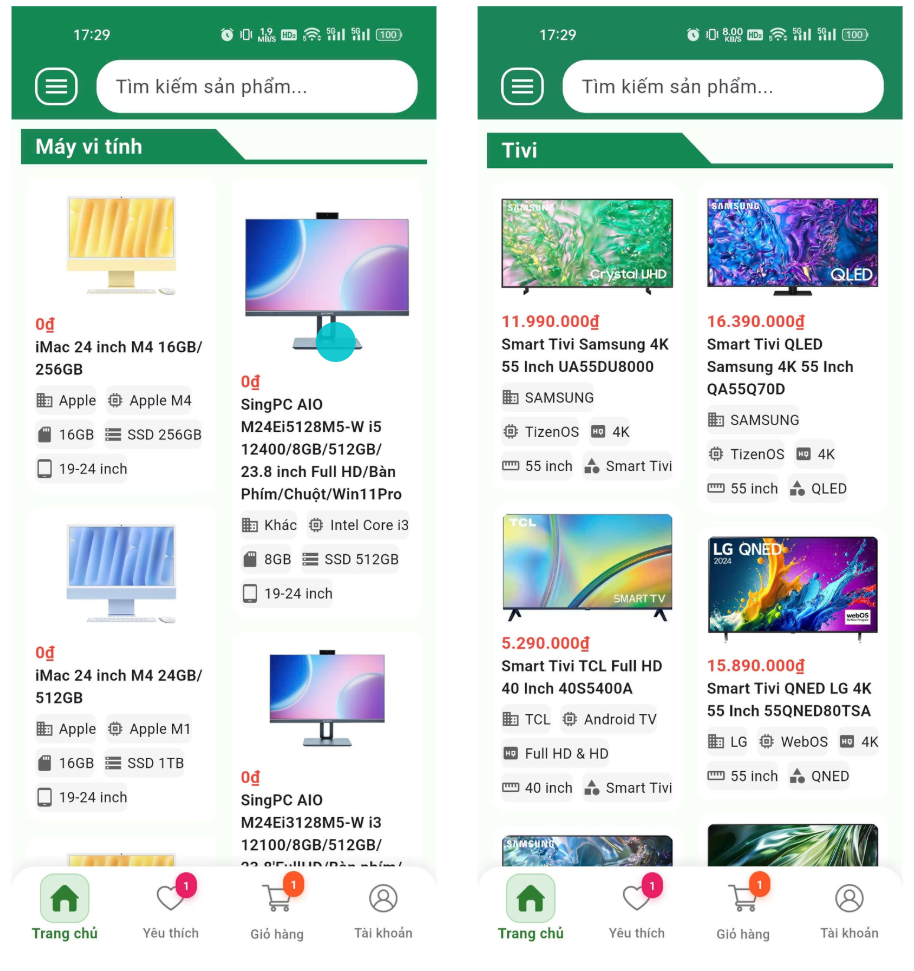
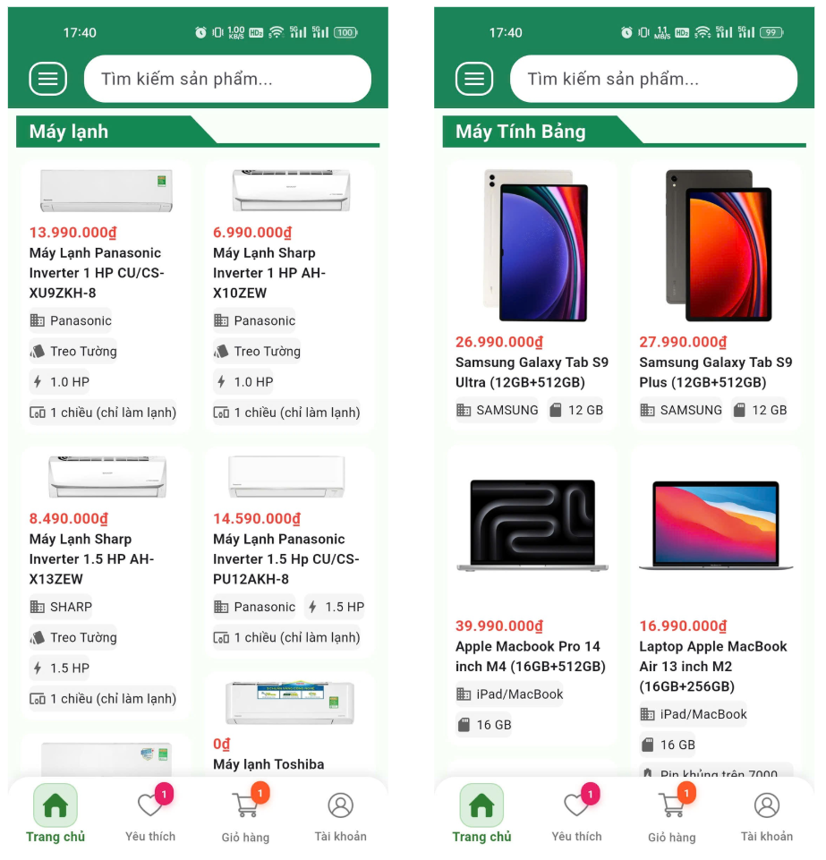
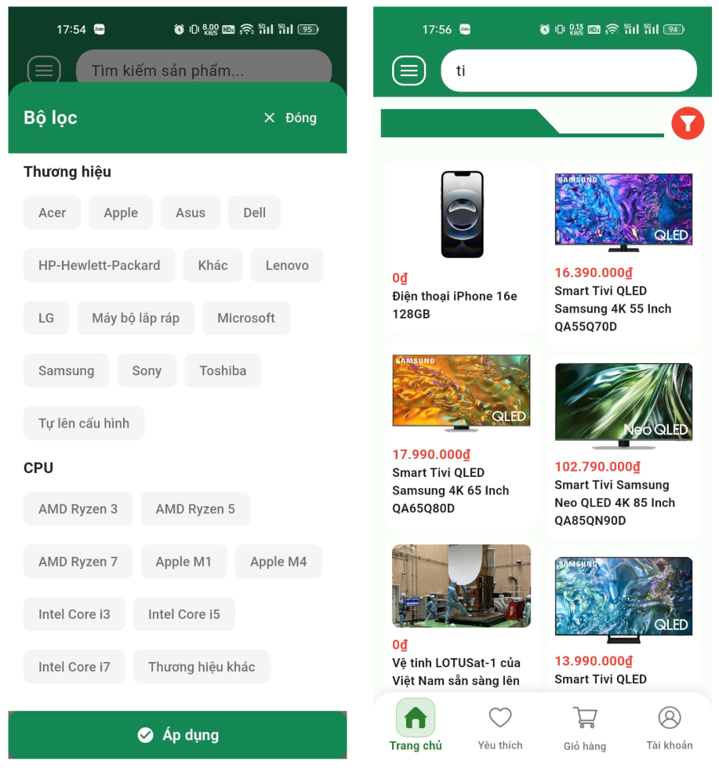
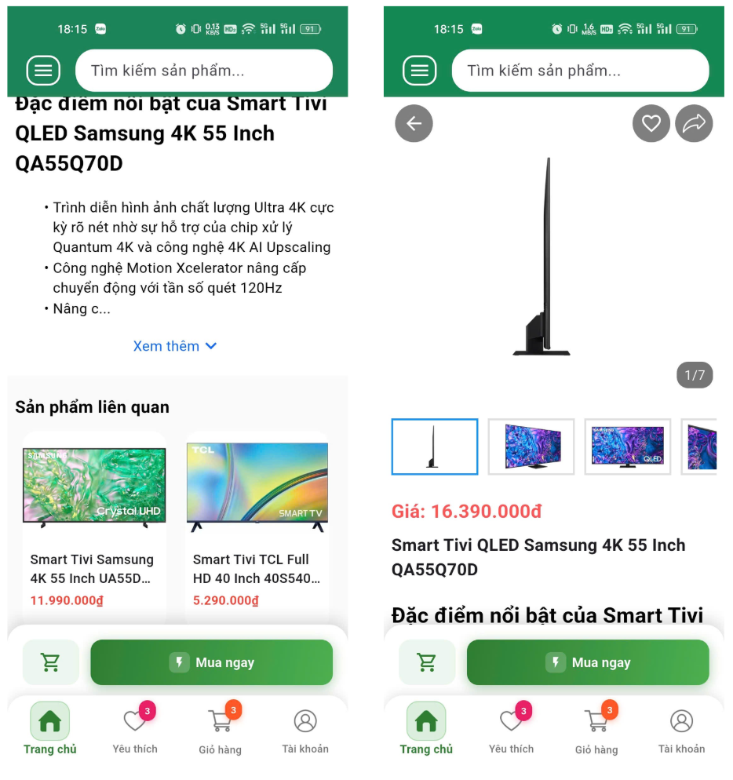
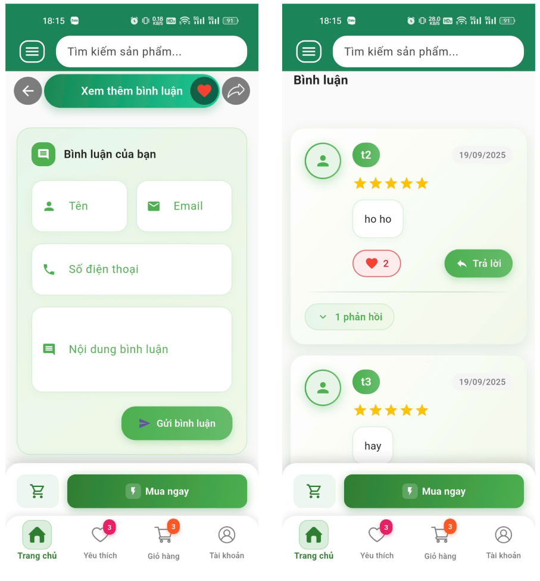
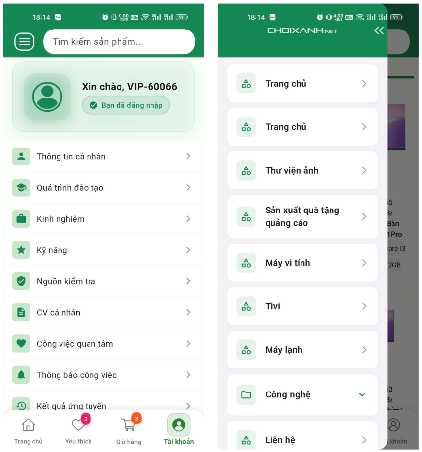
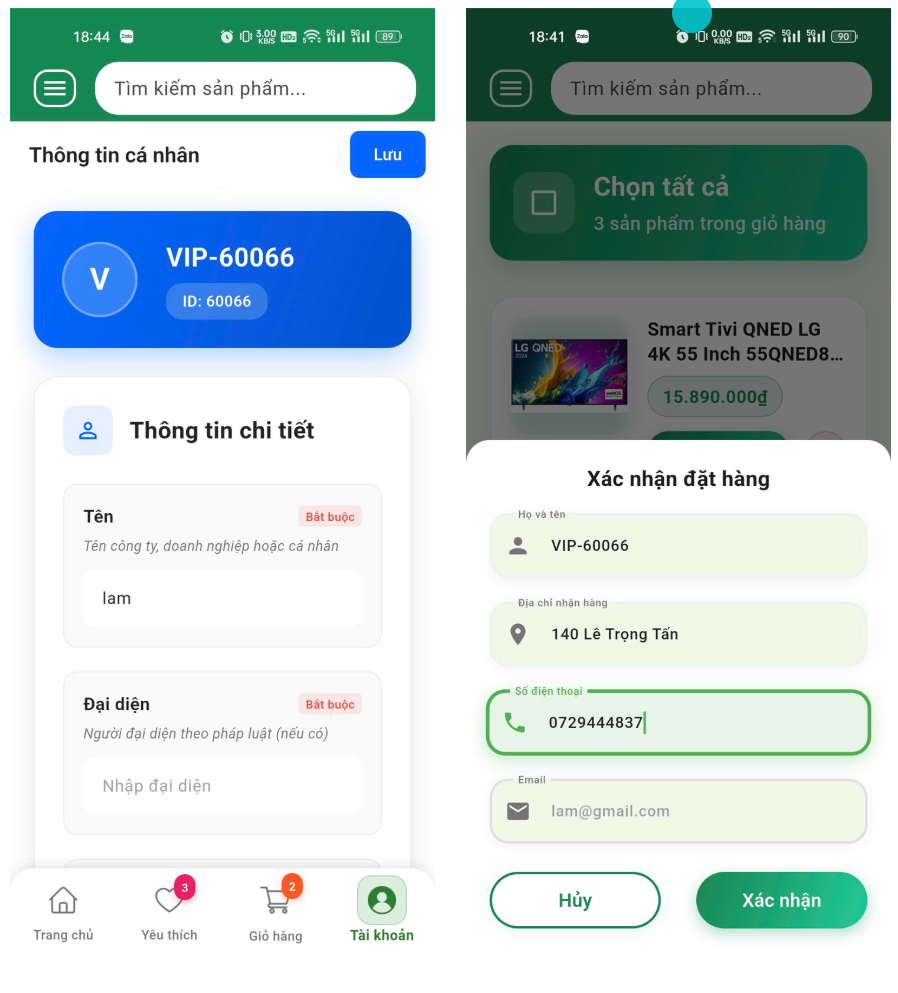

# 📱 Ứng Dụng Mua Bán Trực Tuyến - E-Commerce Mobile App
[cite_start]**Dự án thực tập tốt nghiệp tại Công ty TNHH Tư vấn Dịch vụ Chồi Xanh**[cite: 8, 21].

## 👤 Thông tin sinh viên
* [cite_start]**Họ và tên:** Đinh Nguyễn Nhật Lâm[cite: 12].
* [cite_start]**Mã sinh viên:** 2001222208[cite: 12].
* **Chuyên ngành:** Cử nhân Công nghệ Thông tin (Đã tốt nghiệp).
* [cite_start]**Vị trí thực tập:** Lập trình Mobile App[cite: 9, 124].

---

## 🛠 Công nghệ sử dụng
[cite_start]Dự án ứng dụng mô hình phát triển đa nền tảng (Hybrid App) giúp tối ưu thời gian triển khai trên cả Android và iOS[cite: 168, 850].

| Thành phần | Công nghệ & Kỹ thuật |
| :--- | :--- |
| **Mobile Framework** | [cite_start]**Flutter** (Dart)[cite: 75, 850]. |
| **Backend** | [cite_start]**.NET Core** & **RESTful API**[cite: 127, 891]. |
| **Authentication** | [cite_start]**JWT (JSON Web Token)**[cite: 400, 892]. |
| **Rendering** | [cite_start]Kết hợp **CSR** (Client-Side) & **SSR** (Server-Side Rendering)[cite: 145, 170]. |
| **Optimization** | [cite_start]Cơ chế **Cache** giúp tăng tốc độ tải trang và giảm tải Server[cite: 172, 792]. |
| **Content Tools** | [cite_start]Tích hợp **CKEditor** & **CKFinder** quản lý nội dung[cite: 127, 895]. |

---

## 🚀 Tính năng & Demo Hình ảnh

### 1. Trang chủ & Danh mục sản phẩm
[cite_start]Hệ thống render dữ liệu động từ API, hiển thị đa dạng các mặt hàng như Tivi, Máy vi tính, Máy lạnh...[cite: 279, 281].
* [cite_start]**Kỹ thuật:** Xử lý tinh lọc dữ liệu (mapping) từ JSON sang Flutter Model[cite: 284, 946].

### 2. Bộ lọc & Tìm kiếm (Tuần 5)
[cite_start]Cho phép người dùng tìm kiếm sản phẩm theo từ khóa và lọc chi tiết theo thương hiệu, mức giá, cấu hình CPU[cite: 398, 399].

### 3. Giỏ hàng & Sản phẩm yêu thích (Tuần 6)
[cite_start]Quản lý trạng thái ứng dụng bằng **Provider**, hỗ trợ lưu tạm thời khi chưa đăng nhập và đồng bộ với server khi đã xác thực[cite: 478, 481].

### 4. Chi tiết sản phẩm & Bình luận (Tuần 7)
[cite_start]Hiển thị thông số kỹ thuật, mô tả chi tiết và cho phép người dùng viết nhận xét, đánh giá sản phẩm[cite: 535, 537].

### 5. Quản lý tài khoản & Đặt hàng (Tuần 11)
[cite_start]Người dùng có thể cập nhật thông tin cá nhân (Họ tên, địa chỉ, email) và tiến hành quy trình xác nhận đặt hàng[cite: 789, 790].

---

## 📈 Kết quả đạt được sau 12 tuần
* [cite_start]**Nắm vững quy trình:** Hiểu rõ vòng đời phát triển phần mềm từ thiết kế Figma sang mã nguồn thực tế[cite: 932, 971].
* [cite_start]**Kỹ năng chuyên môn:** Làm chủ các kỹ thuật xử lý API phức tạp, quản lý trạng thái trong Flutter và tối ưu hiệu năng bằng Cache[cite: 929, 931].
* [cite_start]**Tác phong làm việc:** Rèn luyện kỹ năng làm việc nhóm, quản lý thời gian và giải quyết vấn đề trong môi trường doanh nghiệp chuyên nghiệp[cite: 933, 934, 975].

---

## 📝 Liên hệ
* [cite_start]**Đơn vị thực tập:** Công ty TNHH Tư Vấn Dịch vụ Chồi Xanh[cite: 8].
* **Địa chỉ:** 82A-82B Dân tộc, Phường Tân Sơn Nhì, Quận Tân Phú, TP. [cite_start]HCM[cite: 65].
* [cite_start]**Website:** [www.choixanh.net](http://www.choixanh.net)[cite: 69].
